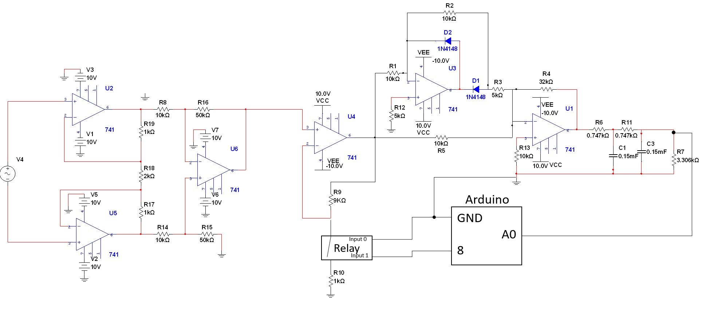
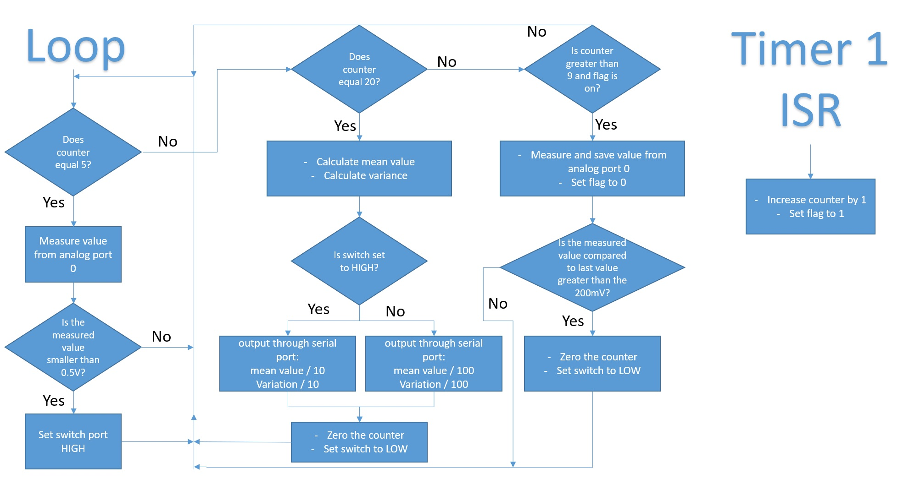
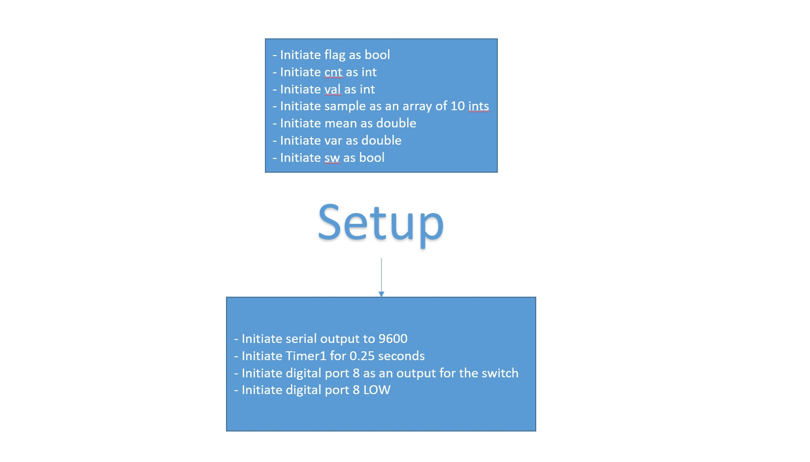

# differential-ac-voltmeter-

The Differential AC Voltmeter can measure a 5Hz signal with 2 ranges: {0 - 50 mV} and {0 - 500 mV} (RMS).
The project is based on an Arduino MCU, and hardware which connects the components.

The full electrical circuit of the AMS bearing and the selected numerical values of all components:

Detailed block chart of the Arduino circuit:

